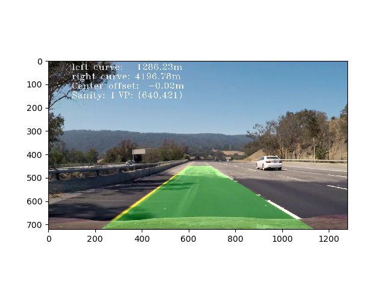
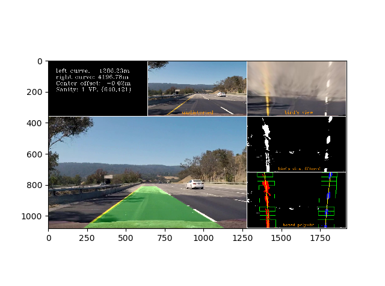
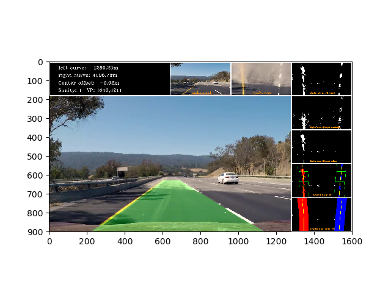
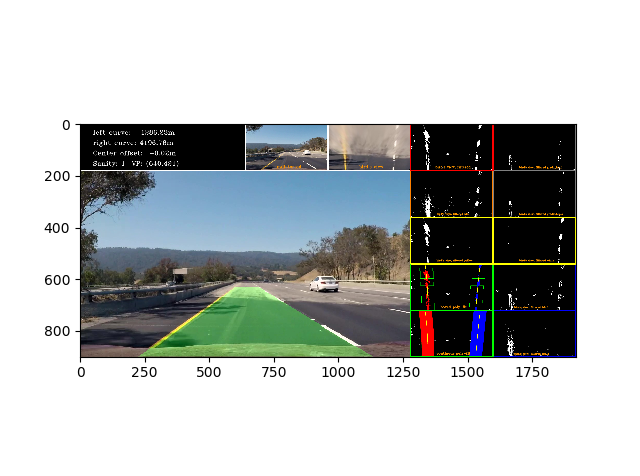

# Project of my own
# *Extended-Lane-Line-Detection*

## Introduction 

This project is based upon Udacity's Nanodegree Self-Driving Car project ['CarND-Advanced-Lane-Lines'](https://github.com/ralf-goettsche/CarND-Advanced-Lane-Lines). It has been extended by the color model representations for easier access to the color channels and filtering, by far more filter options and procedures collected from papers and blogs and by several display and print options added for analysis enabling a far better understanding of color filtering under varying conditions whereas the goal of lane line detection and the underlying algorithms remained the same.

| 

 |  

 |
|:-----:|:------:|
| 

 |  

 |

## Integration

This release offers the following two classes (**`python >= 3.6`**):

* **class_cameracalib.py: cameracalib**  
  Contains all functions needed to calibrate for the camera used to take the photo or movie of the road
* **class_lane_lines.py: lane_lines**  
  Collection of all functions for lane line detection and marking, calculating and displaying filters

There are several examples given on how to include the classes, two for camera calibration and lane line detection on single images (`Example_camera_calib_on_single_img.py`, `Example_lane_lines_on_img.py`) and two for doing the same on movies (`Example_camera_calib_on_mov.py`, `Example_lane_lines_on_mov.py`). The image and movie used in these examples were taken from Udacity's Self-Driving Car project 'CarND-Advanced-Lane-Lines'.

## Call Options

The picutures on top show different possibilities to display the filters and lane line detections.  
In general, the classes can be initialized with the following options:

* class `cameracalib`:
  -  **mode**:  
     'single': Calibration on one dedicated picture  
     'multi':  Calibration on a set of pictures defined by dir location  
  - **deblev**:  
    0: No debug information  
    1: Only textual debug information  
    2: All available debug information  
* class `lane_lines`:
  - **mode**:  
    'picture': Lane detection on a single image  
    'video': Lane detection on a movie  
  - **output**:  
    'none': Pure picture  
    'info': Picture with information  
    'small':  4 additional pics (undistorted pic, bird pic, filtered (all) bird pic, boxed or continous poly-fit)  
    'medium':  7 additional pics (undistorted pic, bird pic, filtered (all) bird pic, hls(white)-filtered bird pic, yellow-filtered bird pic, boxed and continous poly-fitting)  
    'deluxe': 12 additional pics (undistorted pic, bird pic, filtered (all) bird pic, hls(white)-filtered bird pic, yellow-filtered bird pic, boxed and continous poly-fitting, lab pics)
  - **debuglevel**:  
    0: print only media with lines  
    1: all above (aa) + run data  
    2: (aa)  
    3: (aa) + bird pic + grad pics  
    4: (aa) + detailed pics (grad, poly)                                       
    5: plot all debug information [(aa) + HSV pics + HSV bird pics]  

## Filtering Methods 

The class `lane_lines` offers an interesting collection of procedures for filtering taken from different papers and blogs:

* **`grad_color_filter`**  
  In this procedure the filters for lane line detection are defined and combined. Here, one can define some of his own,  
  e.g. the filter for white and yellow lanes, pure lane detection, etc.
* **`convert_image`**  
  All kinds of color transformations of a given RGB ('.jpg' read by `matplotlib.mpimg()`) or BGR ('.png' read by `cv2.imread()`) image on all or specific channels
* **`color_mask'**  
  Eliminating color codes outside of given bounds
* **`lcn`**:  
  A function performing 'Local Contrast Normalization'
* **`hsvnorm`**  
  Performing `lcn` on either saturation ('s') or value ('v') or both (hue remains the same) on a HSV image
* **`abs_sobel_thresh`**  
  Edge detection in given direction and according to given threshold
* **'mag_thresh`**  
  Magnitude of edge calculation in given direction and according to given threshold
* **`dir_threshold`**  
  Direction of edge calculation with direction threshold region consideration
